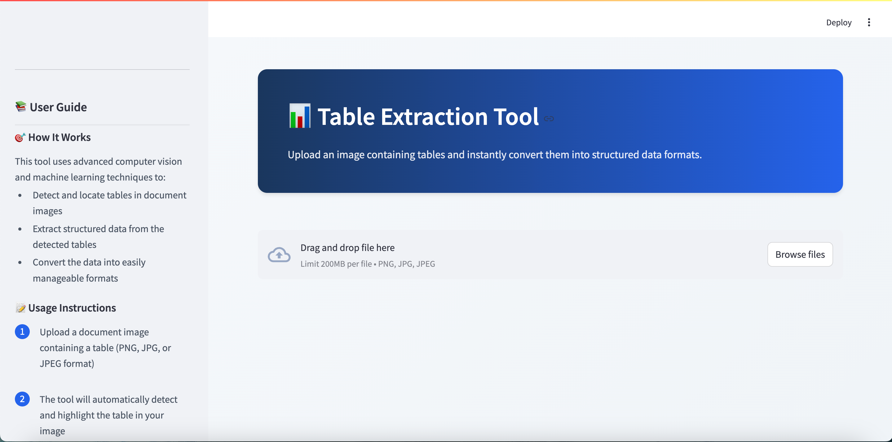
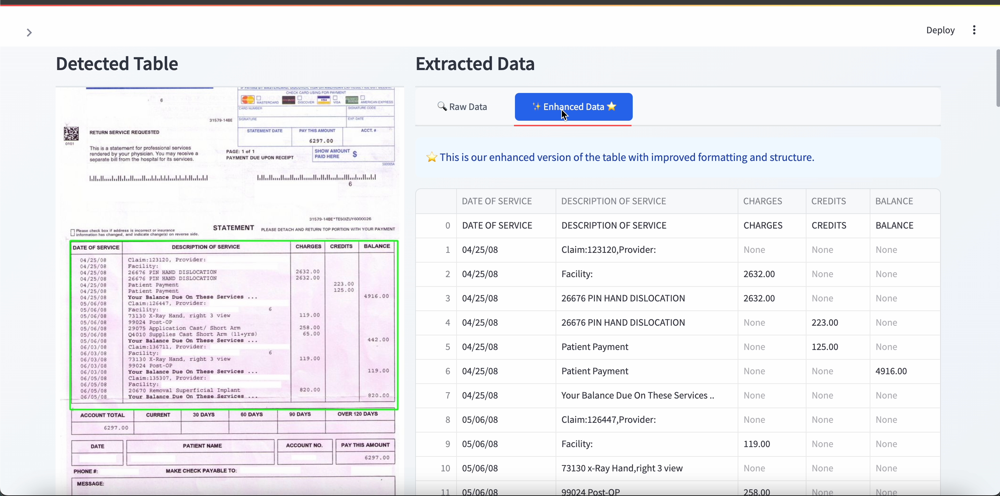
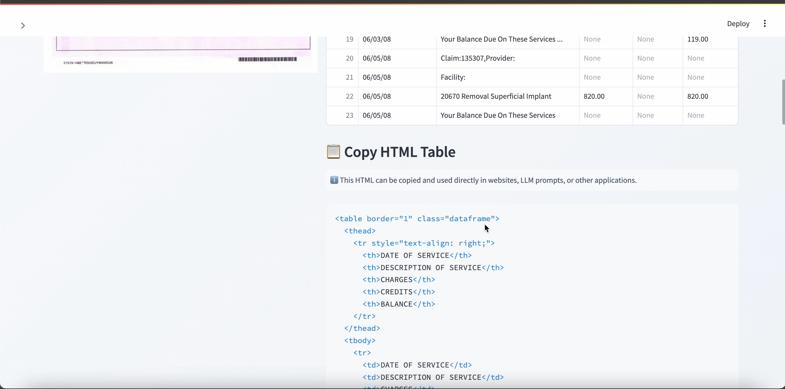
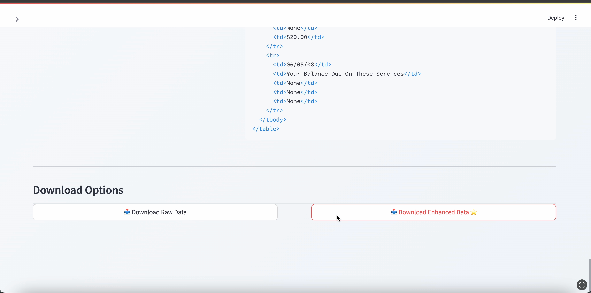

# **🌟 Table Extraction Tool: OCR & Computer Vision for Structured Data**
[](https://opensource.org/licenses/MIT)
[](https://github.com/Sudhanshu1304/table-transformer)
[](https://github.com/Sudhanshu1304/table-transformer/stargazers)
[](https://github.com/Sudhanshu1304/table-transformer/watchers)

## Overview

Table Transformer is an advanced open-source tool that leverages state-of-the-art OCR and computer vision techniques to extract structured tabular data from images. It is ideal for enhancing LLM preprocessing, powering data analysis pipelines, and automating your data extraction tasks.

## Features
- 📊 **Automatic Table Detection**: Effortlessly detect tables in images.
- 📝 **OCR-based Document Processing**: Extract text with high accuracy.
- 🧠 **Integrated Models**: Seamlessly combine OCR and table detection models.
- 💾 **Flexible Export Options**: Export data as DataFrame, HTML, CSV, and more.

---

## **Tool Overview**

<div align="center">

<!-- First Row -->



<!-- Second Row -->



</div>

---

## **Open-Source Tools Used**
- **[PaddleOCR](https://github.com/PaddlePaddle/PaddleOCR)**: For text extraction.
- **[Hugging Face Table Detection](https://huggingface.co/foduucom/table-detection-and-extraction)**: For table structure detection.

---

## **Installation**

### **Prerequisites**
- Python 3.8+
- Conda

### **Setup**

1. **Clone the Repository**

   Clone the repository to your local machine:

   ```bash
   git clone https://github.com/Sudhanshu1304/table-transformer.git
   cd table-transformer
   ```

2. **Create and Activate Conda Environment**

   Create a new conda environment and activate it:

   ```bash
   conda create --name myenv python=3.12.7
   conda activate myenv
   ```

3. **Install PaddlePaddle**

   Install PaddlePaddle in the conda environment:

   ```bash
   python -m pip install paddlepaddle==3.0.0rc1 -i https://www.paddlepaddle.org.cn/packages/stable/cpu/
   ```

4. **Install PaddleOCR**

   Install PaddleOCR:

   ```bash
   pip install paddleocr
   ```

5. **Install Additional Dependencies**

   Install other required packages:

   ```bash
   pip install ultralytics pandas
   pip install streamlit
   ```

### **Project Structure**
```
project/
├── src/
│   ├── streamlit_app.py       # Streamlit application
│   ├── table_creator/
│   │   └── processing.py      # Core processing logic
│   ├── models/
│   │   └── text.py            # table detection and text recognition
│
├── requirements.txt           # Dependencies
├── README.md                  # Project documentation
└── .gitignore                 # Git ignore configuration
```

### **Usage**
Run the Streamlit app to interact with the tool:

```bash
streamlit run src/streamlit_app.py
```

### **Contributions**
Contributions are welcome! Please fork the repository and submit a pull request with your improvements or new features.

### **License**
This project is licensed under the MIT License.

---

## **Connect with Us**
Stay updated and connect for any queries or contributions:

- **GitHub**: [Sudhanshu1304](https://github.com/Sudhanshu1304)
- **LinkedIn**: [Sudhanshu Pandey](https://www.linkedin.com/in/sudhanshu-pandey-847448193/)
- **Medium**: [@sudhanshu.dpandey](https://medium.com/@sudhanshu.dpandey)

---

## **Support**
If you find this tool useful, please consider giving it a ⭐ on GitHub. Your support is greatly appreciated!

Happy Extracting!
